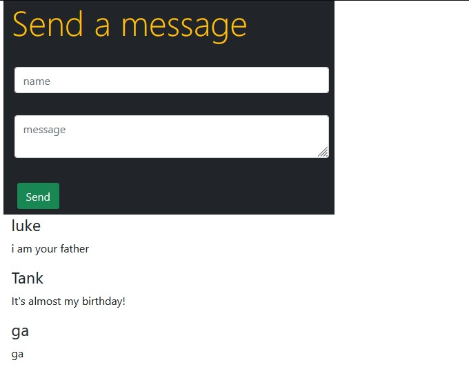

# learning_node
Exercises and applications associated with LinkedIn Learning "Learning Node" class.

In this series we were introduced to Node.js by creating a simple messaging application, styled using bootstrap. 

The application was built using Express, Socket.IO, MongoDB and was tested using Jasmine. 

Messaging app can be deployed by running nodemon and will be accessed via LocalHost:3000

